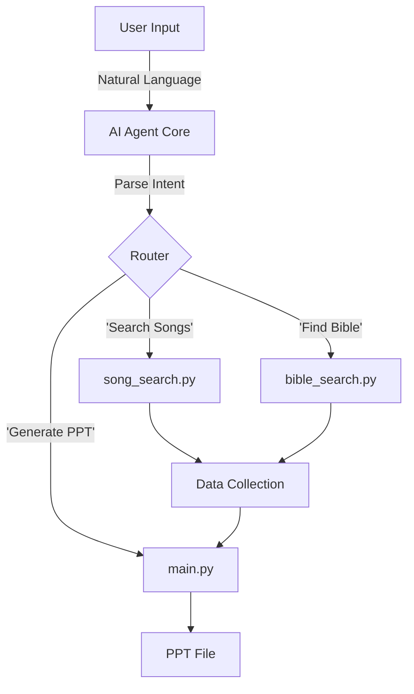

# AI Agent Development Plan (AI Agent MyPPT 1.0)

This plan outlines the steps to create a "Text-to-Workflow" AI agent that automates church service PPT creation using natural language commands. The project is located in `d:\00. WorkSpace\02. Creat\01. Antigravity\2026\01-2. AI Agent MyPPT 1.0\`.

## 1. Goal
Develop a console-based (or simple UI) AI agent that accepts commands like "Prepare Friday service with hymns 28 and 436, Psalm 23" and autonomously executes the necessary Python scripts (`song_search`, `bible_search`, `main.py`) to generate the final PPT.

## 2. Core Architecture
The agent will act as an "Orchestrator" that maps user intent to function calls.

## 3. Implementation Steps

### Phase 1: Foundation & Tool Interface (Current)
- [x] Create v2 directory and copy core modules (`main.py`, `song_search.py`, `bible_search.py`).
- [ ] **Refactor Modules**: Ensure existing scripts can be imported and called easily by an external `agent.py` without relying on `gui.py`.(Current modules are already quite modular, but may need minor tweaks for return values instead of UI callbacks).
- [ ] **Create `agent_tools.py`**: A wrapper file that defines clear, simple functions for the LLM to understand (e.g., `find_hymn(number)`, `get_bible(verse)`).

### Phase 2: 에이전트 로직 및 인터페이스 연동 (`agent_logic.py` & `gui_v2.py`)
- [ ] **규칙 기반 해석기 (Rule-based Parser)**: 사용자 명령어(수요/금요, 찬양 번호, 성경 범위)를 분석하는 정규식(Regex) 엔진 구현.
- [ ] **하이브리드 GUI 구현**: 
    - 기존 UI 우측에 에이전트 패널 추가.
    - [Send] 버튼 및 실시간 로그창 배치.
- [ ] **도구 연동**: 해석된 데이터를 바탕으로 `song_search`, `bible_search`, `main.py`를 순차적으로 호출.

### Phase 3: 품질 검사 및 자동화 (`QA System`)
- [ ] **3단계 QA 로직 구현**: 블로그 분석 -> 슬라이드 수 체크 -> 내부 텍스트 스캔.
- [ ] **검수 자동화**: 작업 완료 후 PPTX 실행 및 지정된 시놀로지 URL 브라우저 실행.
- [ ] **에러 로깅**: 모든 이슈를 `error_log.md`에 기록.

## 4. Immediate Next Task
- Verify the copied files in `01-2. AI Agent MyPPT 1.0`.
- Create a test script `test_agent_capabilities.py` to verify we can call all 3 core functions (song, bible, ppt generation) programmatically from one place.

## User Review Required
- **LLM Choice**: Do you want to use an external API (OpenAI/Anthropic) for the agent's brain, or keep it simple with regex/rule-based logic first? (For "Text-to-Workflow", simple logic is surprisingly effective and free).
- **Interface**: Should this run in a terminal (Command Line) or a simple clean Chat Window?
